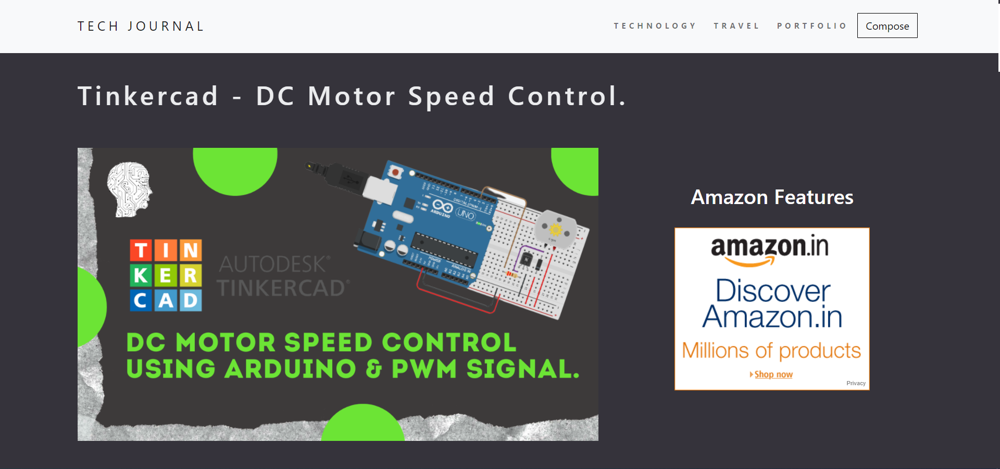
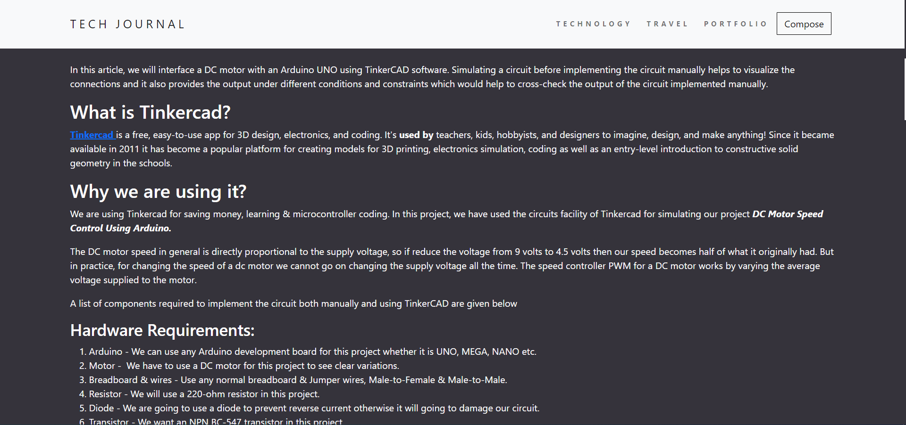
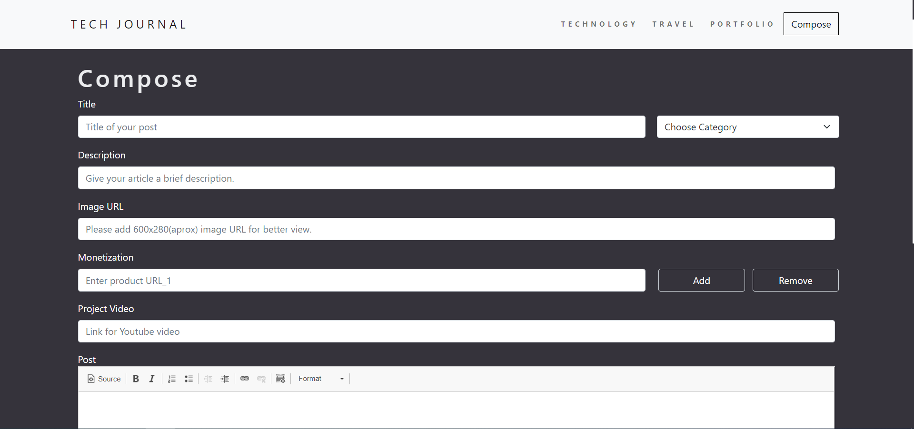

# T E C H_ J O U R N A L  

Tech Journal is a website where readers will find awesome engineering projects related blogs also there will we some more sections such as Technology those section will have blogs related to Programming & Recent Technology.

## H O M E

Home page will have all the blogs, listed under their respective categories. In the screenshot you can see <a href="https://www.harshitgupta.co.in/"> PROJECT </a> category which have various blogs in it.

</img>

## P O S T

When user click on ` Read More ` button then they will be redirected to new page where that particular blog will get opened. On top of it there will be heading of the blog and below heading there will be image of that blog and after that the content of the blog will get displayed also in the end there will be youtube video embedded in each post.

 Post page - 1                               | Post page - 2  
:-------------------------------------------:|:-------------------------------------------:
</img>   |  </img>

## C O M P O S E

Compose is the page from where admin can post new blog under any of the respective categories.

</img>

## A D V A N C E M E N T / M O D I F I C A T I O N S

</img>

<ul>
  <li> Tech journal is not available for everyone i.e not everyone can post blogs on the website, I am working to make this avialable for everyone. </li>
  <li> Setup authentication and authorization. </li>
  <li> Enhancement of User Interface.</li>
</ul>

 

🙏 If you liked it show your support by dropping a star in this repository. 🙏

